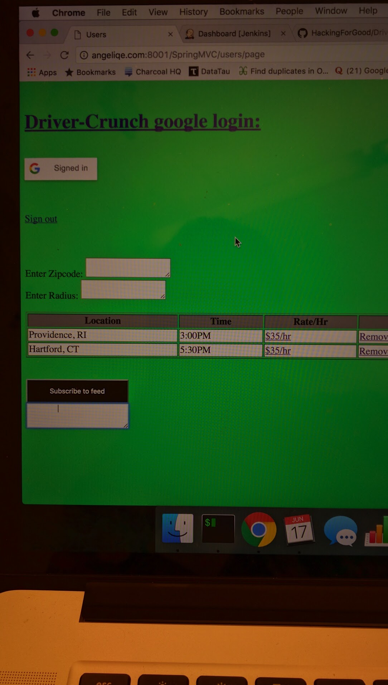

# Driver_Crunch

Improving the working conditions of taxi drivers by predicting future optimal rates.

# Web Frontend image:

# Tech Stack

Gentoo linux, Fedora Linux, Amazon EC2 instance.
Java 1.7 for the guts.
Apache.
Tomcat.
Google API for google login.
Javascript for the serverside glue.
HTML5/CSS/D3js for presentation layer.
Android programming through the android app store.
MySQL for database and crud operations.
Ajax for com between java and javascript and html.
Java can kick off python on the back end to do the ML secret sauce.
Jenkins Continuous integration with one click build.  You don't need apache or tomcat on your system to contribute.

# what is Driver_Crunch

I don't want to give away my genius idea until we're there.  It involves taxi drivers, machine learning. 

# What I have so far

I have a Java MVC front end done with CRUD proof of concept to MySQL and continuous integration one click build.

# Goals

Allow taxi drivers to be more efficient in order to reduce driver stress and increase the amount of free time for their families.
